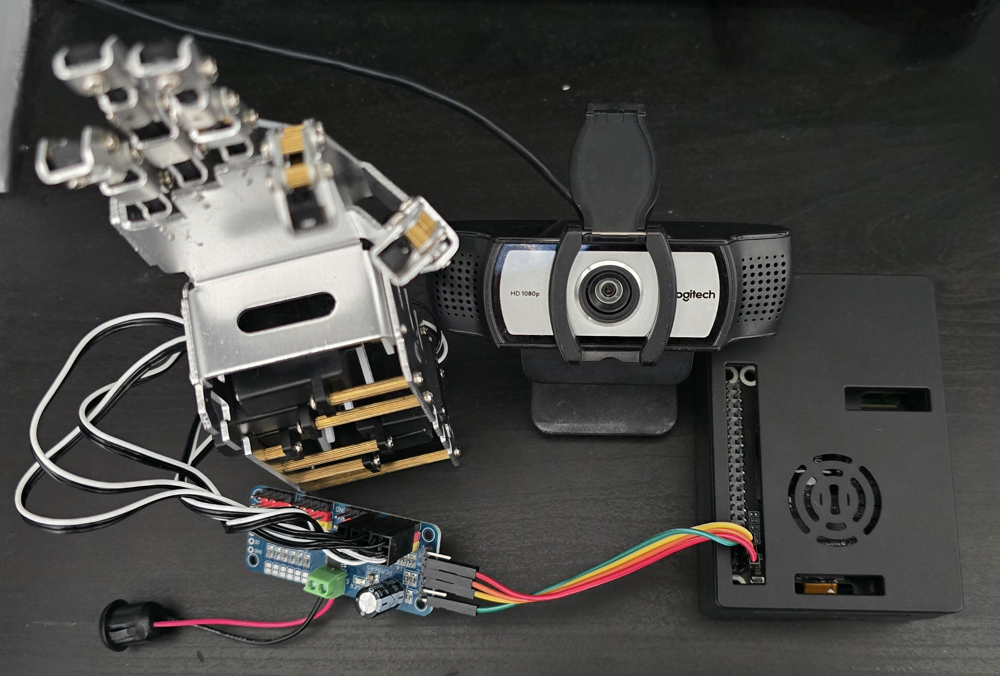
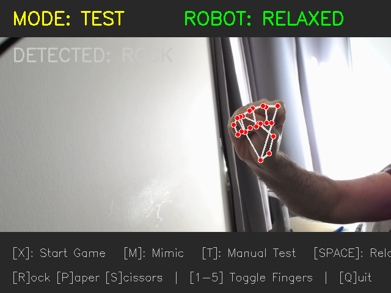
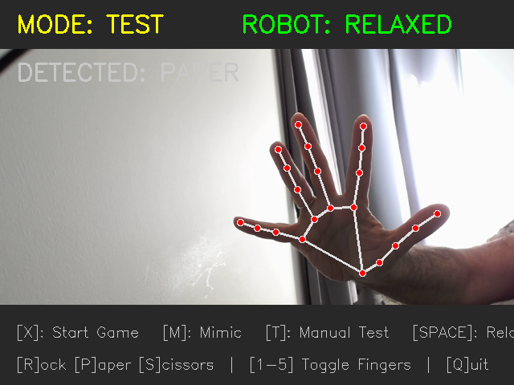
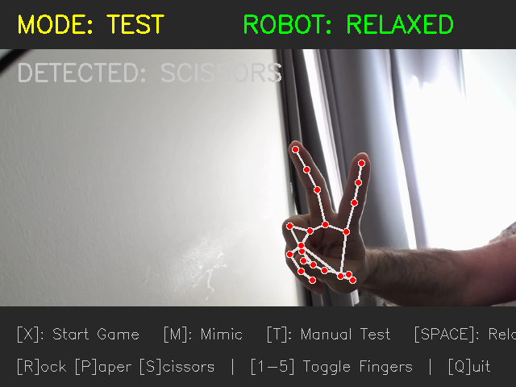

# 🤖 Humanoid-Hand-5DOF-RPS

An AI-powered controller for a **5-DOF Metal Humanoid Robotic Hand**. This project uses a Raspberry Pi 5 and MediaPipe hand tracking to play Rock-Paper-Scissors against a human opponent in real-time.



## 🎮 Features
* **AI Vision:** Real-time hand tracking using MediaPipe and OpenCV.
* **Game Logic:** Complete game loop with Countdown, Showdown, and Scorekeeping.
* **3 Modes:**
    * **Game Mode:** Play a match against the robot with live scoring.
    * **Mimic Mode:** The robot shadows your hand gestures in real-time.
    * **Test Mode:** Manual keyboard control for calibration and debugging.
* **Safety Features:** "Soft Start" boot sequence and "Relax Mode" to prevent servo stall/buzzing.

## 📸 Demo

| Rock | Paper | Scissors |
| :---: | :---: | :---: |
|  |  |  |

## 🛠️ Hardware Requirements
* **Raspberry Pi 5** (Recommended for performance)
* **PCA9685** 16-Channel PWM Servo Driver
* **5-DOF Metal Humanoid Hand** (Uses 5x MG90S/A0090 servos)
* **USB Webcam**
* **Power Supply:** 5V 2A+ external power for the servos.

### 🔌 Wiring & Pinout
This project uses a custom finger mapping for the generic metal hand kit. Ensure your servos are plugged into the PCA9685 as follows:

| Finger | Servo Channel | Logic |
| :--- | :--- | :--- |
| **Thumb** | Channel 2 | Standard |
| **Index** | Channel 0 | Standard |
| **Middle** | Channel 1 | Standard |
| **Ring** | Channel 3 | **Reversed** |
| **Pinky** | Channel 4 | **Reversed** |

## 📦 Installation

1.  **Clone the repository:**
    ```bash
    git clone [https://github.com/assix/Humanoid-hand-5dof-rps.git](https://github.com/assix/Humanoid-hand-5dof-rps.git)
    cd Humanoid-hand-5dof-rps
    ```

2.  **Install dependencies:**
    ```bash
    pip install -r requirements.txt
    ```

3.  **Enable I2C on Raspberry Pi:**
    ```bash
    sudo raspi-config
    # Interface Options -> I2C -> Enable
    ```

## 🚀 Usage

Run the main controller script:
```bash
python main.py
```

### ⌨️ Controls
| Key | Action |
| :--- | :--- |
| **`X`** | **Start Game** (Countdown -> Fight!) |
| **`M`** | **Mimic Mode** (Robot copies you) |
| **`T`** | **Test Mode** (Manual Control) |
| **`SPACE`** | **Relax** (Cut power to motors) |
| **`R` / `P` / `S`** | Force Rock / Paper / Scissors |
| **`1` - `5`** | Toggle individual fingers |
| **`Q`** | Quit |

## ⚙️ Calibration
If your servos are buzzing or moving backward, adjust the `SAFE_MIN` and `SAFE_MAX` values in `main.py`.
* **Current Safety Range:** 3000 - 9000 (Duty Cycle)
* **Anti-Buzz Logic:** Specific limits are hardcoded for Ring (Ch 3) and Middle (Ch 1) fingers to prevent physical stalling against the metal frame.

## 📝 License
[MIT](LICENSE)
